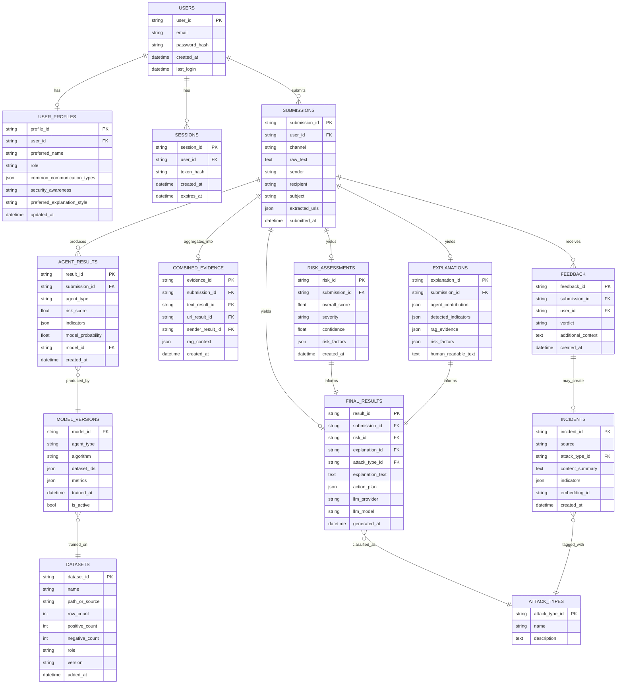

# PhishGuard AI — Database Design

**Version:** 1.0
**Status:** New — no prior version existed
**Related documents:** `prd.md`, `flow_and_system_architecture.md`, `trd.md`, `todo.md`

This document defines the **application database** (runtime state: users, submissions, evidence, results, feedback) and separately documents the **vector stores** and **training datasets** that feed the ML agents and RAG layers. It is written so it can be implemented equally in SQLite (relational, capstone-friendly) or MongoDB (document-based); §8 notes the mapping differences.

---

## 1. Scope

| In scope | Out of scope |
|---|---|
| Application/runtime schema (users, submissions, evidence, risk, explanations, feedback) | Raw training-dataset internals beyond what's needed to trace a model version (full column specs live in `DATASET_INFO.md`) |
| Vector-store collection design (ChromaDB) | Vendor-specific index tuning |
| Dataset/model version tracking | CI/CD or MLOps pipeline design |

---

## 2. Entity-Relationship Overview



---

## 3. Table Reference

### 3.1 `users`
| Field | Type | Notes |
|---|---|---|
| user_id | UUID (PK) | |
| email | string, unique | |
| password_hash | string | hash + salt; never store plaintext |
| created_at | datetime | |
| last_login | datetime | nullable |

### 3.2 `user_profiles`
| Field | Type | Notes |
|---|---|---|
| profile_id | UUID (PK) | |
| user_id | UUID (FK → users) | 1:1 |
| preferred_name | string | |
| role | string | e.g. Student, Professional, General |
| common_communication_types | JSON array | e.g. `["College", "Internship", "Banking"]` |
| security_awareness | enum | `Beginner \| Intermediate \| Advanced` |
| preferred_explanation_style | enum | `Simple \| Detailed` |
| updated_at | datetime | |

> Mirrors the logical schema already defined in `DATA_AND_ML.md` §6 (User Profile RAG record) — this table is the system-of-record; a copy of the same fields is embedded into the vector metadata when indexed into ChromaDB (§6.1), not duplicated in a second relational table.

### 3.3 `sessions`
| Field | Type | Notes |
|---|---|---|
| session_id | UUID (PK) | |
| user_id | UUID (FK) | |
| token_hash | string | |
| created_at / expires_at | datetime | |

### 3.4 `submissions`
| Field | Type | Notes |
|---|---|---|
| submission_id | UUID (PK) | |
| user_id | UUID (FK) | |
| channel | enum | `email \| sms \| url` |
| raw_text | text | sanitized before storage/processing |
| sender / recipient / subject | string | nullable, per channel |
| extracted_urls | JSON array | |
| submitted_at | datetime | |

### 3.5 `agent_results`
One row per agent per submission (up to 3 rows: text, url, sender).

| Field | Type | Notes |
|---|---|---|
| result_id | UUID (PK) | |
| submission_id | UUID (FK) | |
| agent_type | enum | `text \| url \| sender` |
| risk_score | float | |
| indicators | JSON array | |
| model_probability | float | populated for all three agents (Logistic Regression, XGBoost, Random Forest) |
| model_id | UUID (FK → model_versions) | required for all three agents; nullable only if a heuristic-only fallback runs in place of the model |
| created_at | datetime | |

### 3.6 `combined_evidence`
One row per submission — the orchestrator's aggregated evidence object described in `flow_and_system_architecture.md` §4 and `DATA_AND_ML.md` §11.

| Field | Type | Notes |
|---|---|---|
| evidence_id | UUID (PK) | |
| submission_id | UUID (FK), unique | |
| text_result_id / url_result_id / sender_result_id | UUID (FK → agent_results) | |
| rag_context | JSON | top-K similar incidents at time of analysis |
| created_at | datetime | |

### 3.7 `risk_assessments`
| Field | Type | Notes |
|---|---|---|
| risk_id | UUID (PK) | |
| submission_id | UUID (FK), unique | |
| overall_score | float 0–100 | |
| severity | enum | `Low \| Medium \| High` |
| confidence | float 0–1 | |
| risk_factors | JSON array | `[{ "factor": "Payment request", "weight": 0.9 }, ...]` |
| created_at | datetime | |

### 3.8 `explanations`
| Field | Type | Notes |
|---|---|---|
| explanation_id | UUID (PK) | |
| submission_id | UUID (FK), unique | |
| agent_contribution | JSON | which agent drove the score |
| detected_indicators | JSON | |
| rag_evidence | JSON | |
| risk_factors | JSON | mirrors `risk_assessments.risk_factors` for display |
| human_readable_text | text | pre-LLM structured explanation |

### 3.9 `attack_types` (lookup table)
| Field | Type | Notes |
|---|---|---|
| attack_type_id | UUID (PK) | |
| name | string | e.g. `Internship Scam`, `Credential Phishing`, `Invoice Fraud`, `Advance-Fee Scam`, `Generic Phishing` |
| description | text | |

### 3.10 `final_results`
| Field | Type | Notes |
|---|---|---|
| result_id | UUID (PK) | |
| submission_id | UUID (FK), unique | |
| risk_id / explanation_id / attack_type_id | UUID (FK) | |
| explanation_text | text | GenAI output |
| action_plan | JSON array | ordered steps |
| llm_provider / llm_model | string | for auditability |
| generated_at | datetime | |

### 3.11 `feedback`
| Field | Type | Notes |
|---|---|---|
| feedback_id | UUID (PK) | |
| submission_id | UUID (FK) | |
| user_id | UUID (FK) | |
| verdict | enum | `confirmed_phishing \| confirmed_legitimate \| incorrect \| unsure` |
| additional_context | text | nullable |
| created_at | datetime | |

### 3.12 `incidents`
System-of-record for confirmed incidents that get indexed into the Phishing/Incident RAG (mirrors `DATA_AND_ML.md` §6 incident schema).

| Field | Type | Notes |
|---|---|---|
| incident_id | UUID (PK) | |
| source | enum | `user_confirmed \| dataset \| manual` |
| attack_type_id | UUID (FK) | |
| content_summary | text | |
| indicators | JSON array | |
| embedding_id | string | pointer to the corresponding ChromaDB vector ID |
| created_at | datetime | |

### 3.13 `datasets`
Tracks every training dataset used, including the ones intentionally excluded from the core pipeline.

| Field | Type | Notes |
|---|---|---|
| dataset_id | UUID (PK) | |
| name | string | e.g. `PhiUSIIL_Phishing_URL_Dataset` |
| path_or_source | string | |
| row_count | int | |
| positive_count / negative_count | int | |
| role | enum | `primary \| augmentation \| sms \| future_out_of_scope` |
| version | string | |
| added_at | datetime | |

Seed values from the audited dataset inventory (`DATASET_INFO.md`) are listed in §7.

### 3.14 `model_versions`
| Field | Type | Notes |
|---|---|---|
| model_id | UUID (PK) | |
| agent_type | enum | `text \| url \| sender` |
| algorithm | string | e.g. `TF-IDF + Logistic Regression`, `XGBoost` |
| dataset_ids | JSON array (FK → datasets) | |
| metrics | JSON | `{ "precision": 0, "recall": 0, "f1": 0, "roc_auc": 0 }` — populate only with measured values |
| trained_at | datetime | |
| is_active | bool | which version is currently serving |

---

## 4. Indexing Recommendations

| Table | Index |
|---|---|
| `users` | unique index on `email` |
| `sessions` | index on `token_hash`, `user_id` |
| `submissions` | index on `user_id`, `submitted_at` |
| `agent_results` | index on `submission_id`, `agent_type` |
| `feedback` | index on `submission_id` |
| `incidents` | index on `attack_type_id`, `embedding_id` |
| `model_versions` | index on `agent_type`, `is_active` |

---

## 5. Combined Evidence — Canonical JSON Shape

This is the object passed between the orchestrator, Risk AI, and Explainable AI (matches `DATA_AND_ML.md` §11):

```json
{
  "submission_id": "",
  "text": { "risk": 0, "indicators": [] },
  "url": { "risk": 0, "indicators": [] },
  "sender": { "risk": 0, "indicators": [] },
  "rag": { "similar_cases": [] }
}
```

---

## 6. Vector Stores (ChromaDB)

Vector data is **not** stored in the relational/document database above — only a pointer (`embedding_id`) is kept there for traceability. Two logically separate Chroma collections exist:

### 6.1 `user_profile_vectors`
| Field | Notes |
|---|---|
| id | = `user_profiles.profile_id` |
| embedding | MiniLM / Sentence-Transformer vector of the profile summary |
| metadata | `{ role, security_awareness, communication_types }` |

### 6.2 `incident_vectors`
| Field | Notes |
|---|---|
| id | = `incidents.incident_id` |
| embedding | vector of `content_summary` + key indicators |
| metadata | `{ attack_type, source, indicators }` |

Query flow: `Current Message → Embedding → Vector Search → Top-K Similar Cases` (see `flow_and_system_architecture.md` §6).

---

## 7. Training Dataset Inventory (seed data for `datasets` table)

| dataset_id (suggested) | name | rows | positive | negative | role |
|---|---|---|---|---|---|
| ds_phiusiil | PhiUSIIL_Phishing_URL_Dataset | 235,795 | 134,850 (phishing) | 100,945 (legit) | primary (URL Agent) |
| ds_phishing_email | phishing_email.csv | 82,486 | 42,891 | 39,595 | primary (Text Agent) |
| ds_ceas08 | CEAS_08.csv | 39,154 | 21,842 | 17,312 | primary (Text Agent) |
| ds_enron_email | Enron.csv | 29,767 | 13,976 | 15,791 | primary (Text Agent) |
| ds_spamassassin | SpamAssasin.csv | 5,809 | 1,718 | 4,091 | primary (Text Agent) |
| ds_ling | Ling.csv | 2,859 | 458 | 2,401 | primary (Text Agent) |
| ds_spam_sms | spam_sms.csv | 5,572 | 747 (spam) | 4,825 (ham) | sms |
| ds_nazario | Nazario.csv | 1,565 | 1,565 (100%) | 0 | augmentation |
| ds_nigerian_fraud | Nigerian_Fraud.csv | 3,332 | 3,332 (100%) | 0 | augmentation |
| ds_enron_fraud | enron_data_fraud_labeled_.csv | 447,417 | 12,837 (fraud) | 434,580 | future_out_of_scope |
| ds_sender_features | Sender-feature set (engineered from `CEAS_08`, `Nazario`, `Nigerian_Fraud`, `SpamAssasin` header fields + confirmed incidents) | TBD after assembly | TBD | TBD | primary (Sender Agent — Random Forest) |

**PhiUSIIL column reference (55 columns):** full per-column specification (data type, null counts, descriptions) is documented in `DATASET_INFO.md` §1.1 and should be treated as the authoritative source for URL Agent feature engineering — it is not duplicated here to avoid drift between documents.

---

## 8. Relational (SQLite) vs Document (MongoDB) Mapping

The schema above is written relationally for clarity. If MongoDB is chosen instead:

| Relational table | MongoDB collection | Notes |
|---|---|---|
| `users` + `user_profiles` | `users` | embed profile as a sub-document: `users.profile` |
| `submissions` + `combined_evidence` | `submissions` | embed `agent_results` as `submissions.evidence.{text,url,sender}` and `rag_context` inline |
| `risk_assessments` + `explanations` + `final_results` | `analysis_results` | embed risk, explanation, and final GenAI output as sub-documents of one result per submission |
| `feedback` | `feedback` | unchanged, reference `submission_id` |
| `incidents` | `incidents` | unchanged; `embedding_id` still points to Chroma |
| `datasets` + `model_versions` | `model_registry` | embed `metrics` and `dataset_ids` |
| `sessions` | `sessions` | unchanged, or handled by an auth provider instead |

Either implementation must preserve the same logical fields and the same separation of concerns described in §2–§3.

---

## 9. Data Protection Notes

- Hash+salt all credentials; never log or store plaintext passwords.
- `submissions.raw_text` may contain sensitive third-party content — sanitize before storage and restrict read access to the submitting user.
- Do not copy test-split records from `datasets` into `incidents`/RAG during evaluation (see `trd.md` §6.2 and `DATA_AND_ML.md` §10) — this would leak test data into retrieval and invalidate evaluation results.
- Keep `enron_data_fraud_labeled_.csv`-derived data, if ever used, in a clearly separate `role = future_out_of_scope` dataset record and a separate model/evaluation track from the phishing classifiers.
