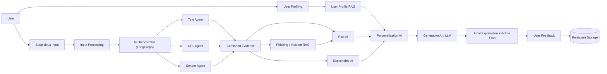
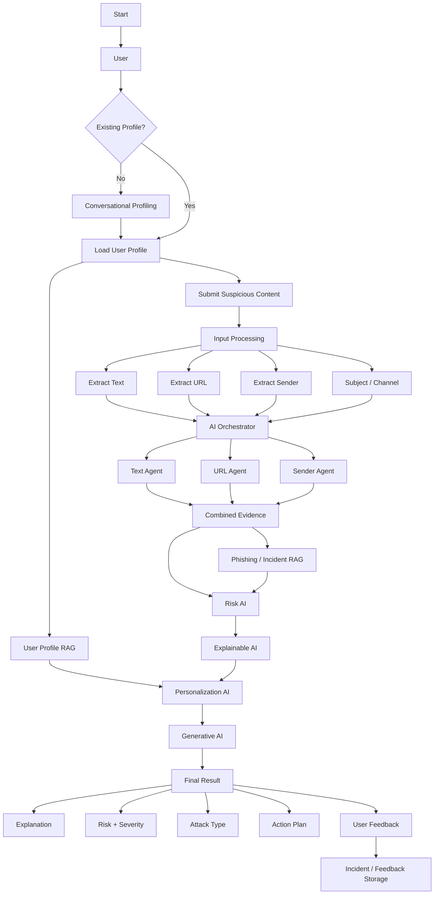
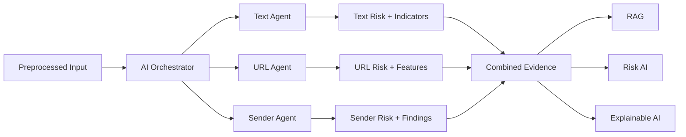
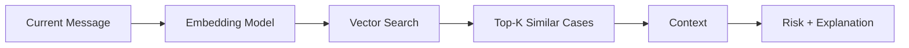
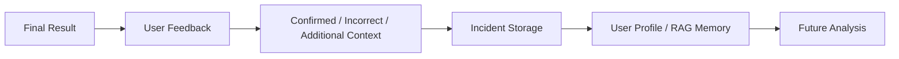

# PhishGuard AI — Flow & System Architecture

**Version:** 2.0
**Status:** Active — merges and supersedes `DESIGN_FLOW.md` and the architecture sections of `TRD.md`
**Related documents:** `prd.md`, `trd.md`, `database.md`, `todo.md`

---

## 1. Core Design Principle

PhishGuard AI follows one consistent pipeline, from first contact with the user through to long-term memory:

**Understand User → Analyze Threat → Retrieve Context → Assess Risk → Explain → Personalize → Generate Guidance → Learn**

Every component in this document maps to one stage of that pipeline.

---

## 2. High-Level System Architecture



**Layer summary**

| Layer | Technology | Answers |
|---|---|---|
| Frontend | React + Vite, React Charts | How the user sees and interacts with the system |
| Backend | FastAPI | Coordinates requests, persistence, and downstream services |
| Orchestration | LangGraph + LangChain | Which agents run, in what order, with what evidence |
| ML Agents | Scikit-learn (TF-IDF + Logistic Regression), XGBoost, Random Forest | "What patterns look suspicious?" |
| RAG | ChromaDB + MiniLM / Sentence-Transformers | "What do we already know?" |
| Risk AI | Rule/weight-based fusion engine | "How risky is this overall?" |
| Explainable AI | SHAP-style evidence attribution | "Why this result?" |
| Personalization AI | Profile-aware prompt construction | "How should this be adapted to the user?" |
| Generative AI | LLM (OpenAI / Gemini / Claude / Ollama) | "How do we communicate this clearly?" |
| Persistence | MongoDB / SQLite | Users, profiles, incidents, feedback (see `database.md`) |

---

## 3. End-to-End User Flow



---

## 4. Agent-Level Flow



The orchestrator dispatches all three agents **in parallel**; none of them decides the final verdict independently. Each agent only contributes *evidence* — text risk, URL risk, sender risk, and their supporting indicators — to a combined evidence object (see `database.md` §5 for its stored shape).

---

## 5. Component-Level Flows

### 5.1 Text Agent Flow

```text
Message Text
    ↓
Text Preprocessing (clean, normalize, preserve security-relevant patterns)
    ↓
TF-IDF Feature Extraction (fit on training data only)
    ↓
Logistic Regression
    ↓
Text Risk Signal + Detected Indicators
```

Trained on the consolidated email/SMS corpus described in `trd.md` §6.2.

### 5.2 URL Agent Flow

```text
URL
 ↓
URL Feature Extraction (structure, domain, DOM/HTML signals)
 ↓
XGBoost
 ↓
URL Risk Signal + Flagged URL Features
```

Trained on the PhiUSIIL Phishing URL Dataset (235,795 rows, 54 engineered features).

### 5.3 Sender Agent Flow

```text
Sender Information
 ↓
Sender Feature Extraction
 ↓
Random Forest
 ↓
Sender Risk + Findings
```

Trained on engineered sender features (sender/domain relationship, display-name vs. domain consistency, reply-to mismatch, authentication results, domain reputation) sourced from header-bearing datasets plus confirmed incidents — see `trd.md` §5.3 and `database.md` §7. Simple heuristic checks (e.g. exact domain match) may still run alongside the model as a fallback when a feature is missing.

---

## 6. RAG Architecture & Flows

Two logically separate RAG stores exist; they must not be merged, since they answer different questions.

### 6.1 User Profile RAG — *"What do we know about the user?"*

```text
User Onboarding / History
        ↓
Profile Information
        ↓
Embedding / Storage
        ↓
Vector Database (ChromaDB)
        ↓
Relevant User Context
```

### 6.2 Phishing / Incident RAG — *"What known patterns match this threat?"*

```text
Current Evidence
        ↓
Embedding (MiniLM / Sentence-Transformer)
        ↓
Vector Search (ChromaDB)
        ↓
Top-K Similar Cases
        ↓
Threat Context
```

**Retrieval pipeline (query time):**



Example: `internship + ₹2,000 payment + 2-hour deadline → embedding + search → similar previous incident`. Any displayed similarity percentage is a real system output only once retrieval is implemented and evaluated — never a placeholder presented as measured.

---

## 7. Risk Analysis Flow

```text
Text Risk
    +
URL Risk
    +
Sender Risk
    +
RAG Context
    ↓
Risk AI
    ↓
Overall Risk Score → Severity → Confidence → Risk Factors
```

The exact weighting formula must be defined and validated experimentally, not assumed. See `trd.md` §10 for the current logical design.

---

## 8. Explainability Flow

```text
Final Risk
    ↓
Explainability Layer
    ├── Agent Contribution
    ├── Detected Indicators
    ├── Similar Incident Evidence
    └── Risk Factors
            ↓
      Human-readable "Why"
```

---

## 9. Personalization Flow

```text
User Profile
     +
Current Threat
     +
Risk Assessment
     +
Retrieved Evidence
     ↓
Personalization AI
     ↓
User-specific Guidance
```

Personalization changes *how* guidance is communicated (tone, examples, emphasis) — it must never fabricate or suppress evidence.

---

## 10. GenAI Generation Flow

```text
Structured Evidence
       +
Risk Assessment
       +
Explanation Factors
       +
User Context
       ↓
     LLM
       ↓
Explanation + Summary + Action Plan
```

---

## 11. Feedback Loop



---

## 12. UI Result Flow

The expected result screen contains:

```text
PHISHING RISK
91 / 100
HIGH RISK

ATTACK TYPE
Internship Scam

MAJOR INDICATORS
✓ Payment request
✓ Urgency
✓ Suspicious URL
✓ Possible impersonation

SIMILAR INCIDENT
91% match

EXPLANATION
Why the message is risky.

PERSONALIZED ACTION PLAN
1. Do not click the link or make payment.
2. Verify through the official organization website.
3. Report/block when appropriate.
4. Watch for similar messages.
```

All numerical values shown here are presentation examples, not guaranteed values for every message.

---

## 13. Worked Example

**Input**
```text
"Congratulations! You have been selected for an internship.
Pay ₹2,000 within 2 hours using the link below."
```

| Component | Output |
|---|---|
| Text Agent | Urgency, payment request, internship/social-engineering context |
| URL Agent | Suspicious URL structure, obfuscation, domain-related concern |
| Sender Agent | Domain mismatch, possible impersonation |
| RAG | Retrieves similar internship scams / payment-request phishing incidents |
| Risk AI | Combines evidence into an overall score |
| Explainable AI | Shows which signals contributed |
| Personalization + GenAI | *"This message is high risk because it asks for an internship registration/payment fee, creates urgency, and contains suspicious indicators. Verify the opportunity through the organization's official website before taking any action."* |

---

## 14. Design Rules

1. Keep agents specialized — no single agent should become a monolithic detector.
2. Keep ML evidence separate from LLM-generated explanation.
3. Treat RAG as contextual evidence, not proof by itself.
4. Make risk factors traceable back to their source agent/dataset.
5. Personalization changes guidance, never fabricates evidence.
6. Store user feedback only with appropriate privacy controls.
7. Clearly communicate uncertainty; never present the risk score as absolute truth.
8. Preserve the evidence chain end to end:

**Input → Evidence → Retrieval → Risk → Explanation → Guidance**
