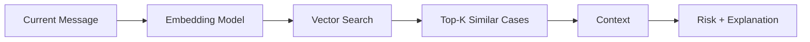

# PhishGuard AI — Technical Requirements Document (TRD)

**Version:** 2.0
**Status:** Active — supersedes the original `TRD(3) (1).md`
**Related documents:** `prd.md`, `flow_and_system_architecture.md`, `database.md`, `todo.md`

---

## 1. Technical Overview

PhishGuard AI uses a modular pipeline combining:

- React + Vite frontend (React Charts for visualization)
- FastAPI backend
- LangGraph + LangChain orchestration
- Machine-learning models (Scikit-learn — Logistic Regression & Random Forest, XGBoost)
- Generative AI / LLMs (provider-independent)
- ChromaDB vector retrieval
- MiniLM / Sentence-Transformer embeddings
- MongoDB / SQLite persistence
- Risk and explainability components (SHAP-style)

Exact deployment configuration is finalized during implementation. See `flow_and_system_architecture.md` for the full architecture diagram and data flows — this document focuses on per-component technical specification.

---

## 2. Frontend

**Technology:** React, Vite, React Charts

**Responsibilities:** authentication screens, dashboard, onboarding/profile UI, suspicious-content input, risk-result display, explanation display, personalized action plan, feedback interaction, analytics/visualization.

---

## 3. Backend

**Technology:** FastAPI

**Responsibilities:** authentication APIs, user-profile APIs, analysis API, input preprocessing, agent coordination interface, RAG retrieval interface, risk-analysis interface, GenAI generation interface, feedback storage, persistence.

---

## 4. AI Orchestration

**Technology:** LangGraph + LangChain

The AI Orchestrator:
1. Receives processed input.
2. Determines the required agent workflow.
3. Dispatches Text, URL, and Sender analysis **in parallel**.
4. Collects agent outputs.
5. Creates a combined evidence set.
6. Passes evidence to downstream RAG / risk / explainability components.
7. Coordinates final response generation.

---

## 5. Agent Specifications

### 5.1 Text Agent

| | |
|---|---|
| **Model** | TF-IDF + Logistic Regression |
| **Input** | Message/email/SMS text |
| **Signals** | Urgency, pressure, payment requests, credential bait, social-engineering language |
| **Training data** | See §6.2 — combined email/SMS corpus |

```json
{
  "agent": "text",
  "risk_score": 0,
  "indicators": [],
  "model_probability": 0,
  "source_dataset": ""
}
```

### 5.2 URL Agent

| | |
|---|---|
| **Model** | XGBoost |
| **Input** | Extracted URL and URL/DOM-derived features |
| **Signals** | URL structure, domain-related information, obfuscation, suspicious patterns |
| **Training data** | PhiUSIIL Phishing URL Dataset (§6.1) |

```json
{
  "agent": "url",
  "risk_score": 0,
  "flagged_features": []
}
```

### 5.3 Sender Agent

| | |
|---|---|
| **Model** | Random Forest |
| **Input** | Sender-related information |
| **Signals** | Sender identity, domain mismatch, impersonation, authentication signals |
| **Training data** | Engineered sender features assembled from header-bearing datasets (`CEAS_08`, `Nazario`, `Nigerian_Fraud`, `SpamAssasin` — each exposes `sender`/`receiver`/`urls`) plus confirmed incidents over time (§6.2, `database.md` §7) |
| **Feature groups** | Sender/domain relationship, display-name vs. domain consistency, reply-to mismatch, authentication results (SPF/DKIM/DMARC where available), historical sender behavior, domain reputation |

```json
{
  "agent": "sender",
  "risk_score": 0,
  "findings": [],
  "model_probability": 0,
  "model_version": ""
}
```

Simple rule/heuristic checks (e.g. exact domain match, missing authentication headers) may still run alongside the model as sanity checks or a fallback when a required feature is missing from the input. Evaluation (precision, recall, F1, confusion matrix) must be reported per §15 before any performance claim is made in documentation or the presentation.

### 5.4 Combined Evidence Model

```text
Text Evidence + URL Evidence + Sender Evidence + Retrieved Context → Combined Evidence Set
```

This set is the single input to Risk AI, Explainable AI, and RAG (see `database.md` §5 for its persisted shape).

---

## 6. Data Foundation

### 6.1 URL Dataset — PhiUSIIL Phishing URL Dataset

- **235,795 rows, 55 columns** (54 engineered features + `label`)
- **Label `1` = Phishing: 134,850 (57.2%)**
- **Label `0` = Legitimate: 100,945 (42.8%)**

  > This corrects earlier presentation material, which had the legitimate/phishing counts swapped.

- Feature categories: URL structure/length, domain/TLD characteristics, obfuscation counts, character/digit/special-character ratios, HTTPS flag, HTML/DOM signals (title, favicon, forms, hidden fields, password fields, iframes, popups), keyword flags (Bank/Pay/Crypto), and link counts (self/external/empty references).
- Full 55-column specification: see `database.md` §7.1.

### 6.2 Text / Email / SMS Datasets

Ten CSV files were audited (~1.02 GB, 853,756 records total). Recommended usage per source:

| Dataset | Rows | Positive Rate | Role |
|---|---|---|---|
| `Email content/phishing_email.csv` | 82,486 | 52.0% | **Primary** combined training corpus (already preprocessed, balanced) |
| `Email content/CEAS_08.csv` | 39,154 | 55.8% | Primary training — adds header/URL-flag metadata |
| `Email content/Enron.csv` | 29,767 | 47.0% | Primary training — legitimate corporate baseline |
| `Email content/SpamAssasin.csv` | 5,809 | 29.6% | Primary training — classic spam/ham baseline |
| `Email content/Ling.csv` | 2,859 | 16.0% | Primary training — academic-domain legitimate mail |
| `spam_sms.csv` | 5,572 | 13.4% | **SMS-channel** training (separate from email; needed for FR-03 SMS input) |
| `Email content/Nazario.csv` | 1,565 | 100% (phishing-only) | Positive-only augmentation / recall stress-test set — cannot be used standalone for a binary classifier |
| `Email content/Nigerian_Fraud.csv` | 3,332 | 100% (fraud-only) | Positive-only augmentation / 419-scam pattern coverage |
| `enron_data_fraud_labeled_.csv` | 447,417 | 2.9% (fraud), separate `POI-Present` flag | **Out of initial scope** — corporate-fraud/insider-threat labeling, not phishing; heavily imbalanced; candidate for a future enterprise-fraud extension only |

**Preprocessing notes:**
- `spam_sms.csv` rows are broken by unescaped commas — recover full text by concatenating `v2` with the `Unnamed: 2/3/4` overflow columns before cleaning.
- Header-bearing sources (`CEAS_08`, `Nazario`, `Nigerian_Fraud`, `SpamAssasin`) additionally expose `sender`, `receiver`, `date`, and a binary `urls` flag — these are the primary source for Sender Agent feature engineering (§5.3) until a dedicated, purpose-built sender-labeled dataset is assembled.
- `Email content/phishing_email.csv` exposes only `text_combined` + `label` — it has no header metadata and should be treated as text-only.
- Fit TF-IDF (and any other data-dependent transform) on the training split only; never on validation/test or on RAG-indexed content used for evaluation.

### 6.3 Other Datasets

| Dataset | Role |
|---|---|
| AI-Generated Phishing Dataset | GenAI robustness testing |
| Synthetic User Profiles | Personalization experiments |
| Previous Incidents (generated by the running system) | User / Phishing RAG |

Full schema-level detail for all datasets is in `database.md` §7.

---

## 7. RAG Architecture

Two logical RAG areas:

### 7.1 User Profile RAG
**Purpose:** *"What do we know about the user?"*
Stores/retrieves: user role, preferences, communication types, security-awareness level, previous incidents, feedback history.

### 7.2 Phishing / Incident RAG
**Purpose:** *"What known patterns match this threat?"*
Retrieves: known phishing cases, phishing patterns, similar incidents, security knowledge.

**Technology:** ChromaDB, MiniLM / Sentence-Transformer embeddings, vector search, Top-K retrieval.

**Retrieval pipeline:**


The displayed similarity percentage is a real system output only after retrieval is implemented and evaluated — treat it as an example until then.

---

## 8. Risk AI

Combines: text risk signal, URL risk signal, sender risk signal, RAG evidence, and other validated contextual signals.

**Output:** overall risk score, severity, confidence, risk factors.

A weighted scoring formula can be implemented, but the exact weights must be defined and validated experimentally rather than assumed.

---

## 9. Explainable AI

Answers: **"Why was this classified as high risk?"**

Expected evidence: agent contribution, detected indicators, RAG evidence, risk factors. SHAP-style evidence visualization is specified for the risk/explainability layer.

---

## 10. Personalization AI

Uses User Profile RAG context to adapt: explanation complexity, examples, recommended actions, communication style, relevant warnings.

*Example:* for a user who frequently receives internship offers, the system emphasizes verification of internship fees and official company channels when those signals are present.

---

## 11. Generative AI Layer

The LLM converts structured evidence into natural-language output. Possible providers: OpenAI, Gemini, Claude, Ollama. The LLM layer should remain provider-independent where practical.

**LLM Input:** user context + agent evidence + retrieved cases + risk assessment + explainability factors
**LLM Output:** risk explanation + attack type + key indicators + personalized action plan

---

## 12. Persistence

**Technology:** MongoDB / SQLite

Logical data areas: users, user profiles, incidents, feedback, RAG/index metadata, analysis results, dataset/model version tracking.

Full entity-relationship design: see `database.md`.

---

## 13. API-Level Design

Suggested logical endpoints (proposed for implementation planning; not claimed to already exist in the codebase):

```text
POST /auth/register
POST /auth/login

GET  /profile
POST /profile/onboarding
PUT  /profile

POST /analyze
GET  /analysis/{id}

POST /feedback
GET  /incidents

GET  /datasets            # dataset/model version metadata (new)
GET  /models/{agent}      # active model version per agent (new)
```

---

## 14. Security Requirements

- Validate all user inputs.
- Sanitize text before processing.
- Do not execute submitted URLs.
- Treat submitted content as untrusted data.
- Protect authentication credentials (hash + salt; never store plaintext).
- Restrict access to user-specific profile and incident records.
- Avoid exposing private user-profile information in another user's response.
- Log security-relevant events without unnecessarily storing sensitive message content.
- Keep the large, imbalanced `enron_data_fraud_labeled_.csv` dataset out of any pipeline that trains or evaluates the phishing classifiers, to avoid label leakage between "fraud" and "phishing" semantics.

---

## 15. Evaluation

### ML
Accuracy, Precision, Recall, F1-score, Confusion matrix, ROC-AUC where appropriate — reported **per source dataset** and on the combined split.

### RAG
Retrieval relevance, Top-K relevance, similar-case quality.

### Explainability
Evidence correctness, indicator traceability, human evaluation of explanation clarity.

### End-to-End
Response time, failure handling, agent concurrency, user feedback.

> Do not report invented performance values anywhere in documentation or the presentation. Add measured values only after running experiments.

---

## 16. Current Project Status

> **Status reset:** implementation has not started yet. Phase 1 is the current starting point; all other phases are planned.

| Phase | Component | Status |
|---|---|---|
| 1 | Authentication + basic dashboard | In Progress (starting) |
| 2 | User profile onboarding | Planned |
| 3 | Text Agent + Text ML | Planned |
| 4 | URL Agent + URL ML | Planned |
| 5 | Sender Agent | Planned |
| 6 | AI Orchestrator | Planned |
| 7 | Phishing RAG + User Profile RAG | Planned |
| 8 | Risk AI | Planned |
| 9 | Explainable AI + Attack Type Detection | Planned |
| 10 | Personalization + GenAI | Planned |
| 11 | Feedback + Similar Incident Analysis | Planned |
| 12 | Evaluation + Final UI Polish | Planned |

Do not present planned components as completed until they are implemented and tested. Full task-level breakdown: `todo.md`.
